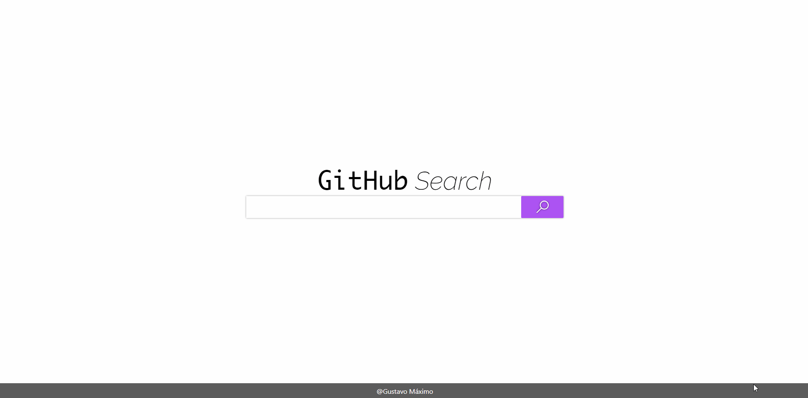

# Concrete Front-End Challenge
> A client-side application that queries the GitHub API and shows the repositories of a particular user.

Intended to showcase my Front-end skills.

## [:fire: Firebase URL :fire:](https://desafio-concrete-9139e.firebaseapp.com/)

## Usage example

This is a search interface for repositories using [GitHub's API](https://developer.github.com/v3/).
You can search a user by it's name and then see his/hers repos on a list.

## Built With

* [React.js](https://reactjs.org/) - JS Framework used
* [React Hooks](https://reactjs.org/docs/hooks-intro.html) - Cleaner/more scalable React API
* [Create React App](https://create-react-app.dev/) - React bootstrapper
* [Redux](https://redux.js.org/) - State container
* [React-Redux](https://github.com/reduxjs/react-redux) - React bindings for Redux
* [Redux-Saga](https://github.com/redux-saga/redux-saga) - Redux middleware
* [Redux Ducks Pattern](https://github.com/erikras/ducks-modular-redux) - Modular Redux Reducer Pattern/Bundle
* [React-Router-DOM](https://www.npmjs.com/package/react-router-dom) - DOM bindings for React Router
* [Flexbox](https://drafts.csswg.org/css-flexbox-1/) - CSS Layout Module
* [axios](https://github.com/axios/axios) - HTTP client
* [GitHub API](https://developer.github.com/v3/) - Used to query the information
* [Firebase](https://firebase.google.com/) -  Development platform used to host the application

## Inspirations and resources

* [Zeplin.io](https://zpl.io/VxYQp7g) - Overall design
* [Monaco font](https://www.cufonfonts.com/font/monaco) - Used for the GitHub header
* [Raleway font](https://www.cufonfonts.com/font/raleway-5) - Used throughout the app
* [Concrete favicon](https://concrete.com.br) - Page icon
* [Puff loading spinner](http://samherbert.net/svg-loaders/) - The loading spinner used

## DEMO



## Installation

*Make sure to have [Git](http://git-scm.com/) and [Node.js](http://nodejs.org/) 10.0.0 (or higher) installed.*

1. Clone it or fork it.

2. Once you have your local copy, install its dependencies using either Yarn:

```
yarn
```

or npm:

```
npm install
```


## Running

After installed, you can start the application by running it with Yarn:

```
yarn start
```

or npm:

```
npm run start
```

*This will start the server at `localhost:3000` (if you didn't change the `PORT` property on `.env`)*

## Meta

Gustavo Máximo – gfmaximo97@gmail.com

## Contributing

I'm not currently accepting pull requests as this is a personal challange for both training and career aspiration purposes.
Feel free to fork it however.

## License

This repository is licensed under [MIT](https://opensource.org/licenses/MIT)
